# STXN Fast-Fill Bridge Architecture

## Complete Technical Flow Diagram

```mermaid
graph TB
    subgraph "User Interface"
        UI[Web Interface<br/>BridgeInterface.tsx]
        UI --> |"1. User inputs amount"| BRIDGE[RealSTXNCallBreakerBridge]
    end

    subgraph "Base Network (Source Chain)"
        USER[👤 User<br/>Initiates Bridge]
        SOLVER_BASE[🔧 Base Solver<br/>0x3a159...]
        ESCROW[🏦 Improved Escrow<br/>0xc1e96b...]
        USDC_BASE[💰 USDC Base<br/>0x036CbD...]
        CALLBREAKER_BASE[⚡ CallBreaker Base<br/>0x7f71a9...]
        
        USER --> |"Triggers"| SOLVER_BASE
        SOLVER_BASE --> |"2. Approve USDC"| USDC_BASE
        SOLVER_BASE --> |"3. depositFor(7 params)"| ESCROW
        USDC_BASE --> |"Transfer USDC"| ESCROW
        ESCROW --> |"Emit DepositRequested"| LOGS_BASE[📋 Event Logs]
        
        SOLVER_BASE --> |"4. Approve CallBreaker"| USDC_BASE
        SOLVER_BASE --> |"5. pushUserObjective"| CALLBREAKER_BASE
    end

    subgraph "STXN Network (Cross-Chain Layer)"
        STXN_RELAYER[🌐 STXN Relayer Network]
        OBJECTIVE[📋 UserObjective<br/>- appId: app.cross.fastfill.v1<br/>- signature: signed message<br/>- callObjects: USDC transfer<br/>- targetChain: Arbitrum]
        
        CALLBREAKER_BASE --> |"Objective Created"| STXN_RELAYER
        STXN_RELAYER --> |"Cross-chain execution"| OBJECTIVE
    end

    subgraph "Arbitrum Network (Destination Chain)"
        CALLBREAKER_ARB[⚡ CallBreaker Arbitrum<br/>0x7f71a9...]
        USDC_ARB[💰 USDC Arbitrum<br/>0x75faf1...]
        ARB_USER[👤 Arbitrum User<br/>0x5A2651...]
        
        OBJECTIVE --> |"6. Execute on Arbitrum"| CALLBREAKER_ARB
        CALLBREAKER_ARB --> |"7. transfer(user, amount)"| USDC_ARB
        USDC_ARB --> |"Transfer USDC"| ARB_USER
    end

    subgraph "Settlement & Claiming"
        SOLVER_BASE --> |"8. solverClaim(depositId, proof)"| ESCROW
        ESCROW --> |"Release USDC to solver"| SOLVER_BASE
        ESCROW --> |"Emit SolverClaim"| LOGS_BASE
    end

    subgraph "Fee Structure"
        FEE[💸 Bridge Fee: 0.05%<br/>User sends: 100 USDC<br/>Fee: 0.05 USDC<br/>User receives: 99.95 USDC]
    end

    style USER fill:#e1f5fe
    style ARB_USER fill:#e8f5e8
    style SOLVER_BASE fill:#fff3e0
    style ESCROW fill:#f3e5f5
    style CALLBREAKER_BASE fill:#ffebee
    style CALLBREAKER_ARB fill:#ffebee
    style STXN_RELAYER fill:#e0f2f1
    style FEE fill:#fff8e1
```



## Detailed Step-by-Step Flow

### Phase 1: Escrow Deposit (Base Network)


### Phase 2: STXN Cross-Chain Execution


### Phase 3: Solver Settlement (Base Network)


## Key Technical Components

### 1. **Improved Escrow Contract**
```solidity
function depositFor(
    address user,           // User address
    uint256 amount,         // Amount to bridge
    uint256 minReceive,     // Minimum user receives (99.95%)
    uint256 feeCap,         // Maximum fee (0.05%)
    uint256 targetChainId,  // Arbitrum chain ID
    address targetToken,    // USDC on Arbitrum
    bytes32 nonce          // Unique identifier
) external
```

### 2. **STXN CallBreaker Integration**
```javascript
const userObjective = {
    appId: "0x6170702e63726f73732e66617374666696c6c2e7631", // "app.cross.fastfill.v1"
    nonce: BigInt(Date.now()),
    tip: parseUnits('0.0001', 18),
    chainId: 421614n, // Arbitrum Sepolia
    maxFeePerGas: parseUnits('0.000000002', 18),
    maxPriorityFeePerGas: parseUnits('0.000000001', 18),
    sender: BASE_SOLVER_ADDRESS,
    signature: await account.signMessage({ message: 'STXN Fast-Fill Bridge' }),
    callObjects: [{
        addr: USDC_ARBITRUM_ADDRESS,
        callvalue: encodePacked(['bytes4', 'address', 'uint256'], 
                               ['0xa9059cbb', ARB_USER_ADDRESS, amount])
    }]
}
```

### 3. **Cross-Chain Call Object**
```javascript
const transferCalldata = encodePacked(
    ['bytes4', 'address', 'uint256'],
    ['0xa9059cbb', ARB_USER_ADDRESS, minReceive] // transfer(address,uint256)
)
```

## Security & Trust Model

### **Trust Assumptions:**
1. **STXN Network**: Trusted for cross-chain execution
2. **Solver Authorization**: Only authorized solvers can claim
3. **Escrow Contract**: Immutable and audited
4. **Signature Verification**: Prevents unauthorized objectives

### **Risk Mitigation:**
- ✅ **Escrow Protection**: Funds locked until proof provided
- ✅ **Solver Authorization**: Whitelist prevents malicious claims  
- ✅ **Signature Validation**: Prevents objective manipulation
- ✅ **Event Monitoring**: All actions are logged and verifiable

## Performance Characteristics

| Metric | Value |
|--------|-------|
| **Bridge Fee** | 0.05% |
| **Settlement Time** | ~30 seconds |
| **Gas Cost (Base)** | ~150,000 gas |
| **Gas Cost (Arbitrum)** | ~100,000 gas |
| **Minimum Amount** | 1 USDC |
| **Maximum Amount** | No limit (liquidity dependent) |

This architecture provides **instant liquidity** through solver networks while maintaining **security** through escrow contracts and **decentralization** through STXN cross-chain execution.
